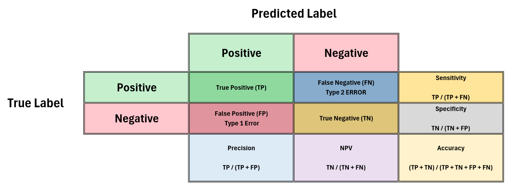

# 📌 Negative Predictive Value (NPV) in Clinical AI Evaluation

## 🧠 About the Project

This repository includes a visual and conceptual explanation of how **Negative Predictive Value (NPV)** can remain high even when overall **accuracy** is low — a scenario that still holds strong clinical value in real-world healthcare applications.

The visualization was prepared in **Excel**, and focuses on binary classification confusion matrix relationships between:
- Actual Class (True Label)
- Predicted Class (Model Output)

---

## 🎯 Why This Matters

In most AI and machine learning projects, evaluation metrics like **precision**, **recall**, **F1-score**, and **accuracy** are often prioritized.

However, in **clinical applications**, the priorities shift.

One often overlooked yet **clinically critical** metric is **Negative Predictive Value (NPV)**:

> 🔎 **NPV** indicates the likelihood that a person with a negative test result is truly disease-free.  
> It becomes especially important in **screening scenarios** — where the aim is to confidently identify individuals without the disease.

This metric ensures that when a model says *"you are healthy,"* it is almost always correct — a key requirement in healthcare.

---

## 📊 What the Table Shows

The table visualized in this project represents a 2x2 confusion matrix:

|                 | **Predicted Positive** | **Predicted Negative** |
|-----------------|------------------------|------------------------|
| **Actual Positive** | True Positive (TP)       | False Negative (FN) - Type II Error |
| **Actual Negative** | False Positive (FP) - Type I Error | True Negative (TN)       |

Below are the related metric formulas using confusion matrix terms:

| **Metric**     | **Formula**                          |
|----------------|--------------------------------------|
| Sensitivity    | TP / (TP + FN)                       |
| Specificity    | TN / (TN + FP)                       |
| Accuracy       | (TP + TN) / (TP + TN + FP + FN)      |
| Precision      | TP / (TP + FP)                       |
| NPV            | TN / (TN + FN)                       |

---

## 💬 Reflections from Real-World Data

During my thesis work using real clinical datasets, I learned an important lesson:

> Even if the model’s **accuracy is modest**, a **high NPV** can make it **clinically valuable**.

In clinical practice, it’s common to hear:
> **“Low accuracy may be acceptable if NPV is high.”**

This underscores the fact that:
- **Evaluation metrics should always be context-dependent.**
- **Reducing false negatives is crucial in early disease detection.**

This approach prioritizes not just statistical correctness but **human lives** behind the predictions.

---

##

  <strong>Confusion Matrix</strong> 

*Figure: Confusion matrix showing the relationship between predicted and actual classes.*
##
The Excel-based visual included in this repository shows:
- Confusion matrix with labeled cells (TP, FP, FN, TN)
- Descriptions of error types and core metric formulas

_Alternative Text (for accessibility):_  
**Binary classification confusion matrix showing TP, FP, FN, TN and associated metric formulas (Sensitivity, Specificity, Precision, NPV, Accuracy). Designed for clinical model evaluation.**

---

📩 **Contact**

If you have any questions, suggestions, or encounter any issues, feel free to reach out.  
You can contact me via [LinkedIn](https://www.linkedin.com/in/emirkan-beyaz-07732933b) or email me at: beyazemirkan01@gmail.com

---

## 📄 License

This work is licensed under the **[Creative Commons Attribution 4.0 International (CC BY 4.0)](https://creativecommons.org/licenses/by/4.0/)** license.

You are free to:
- Share, copy, adapt, and redistribute the content for any purpose, even commercially.
- Just give appropriate credit and indicate if changes were made.

---

## 🔗 Keywords / Tags

`#AI` `#Healthcare` `#ClinicalAI` `#NPV` `#MachineLearning` `#DeepLearning` `#Precision` `#Recall` `#Accuracy` `#MedicalAI` `#ConfusionMatrix` `#DataScience`
